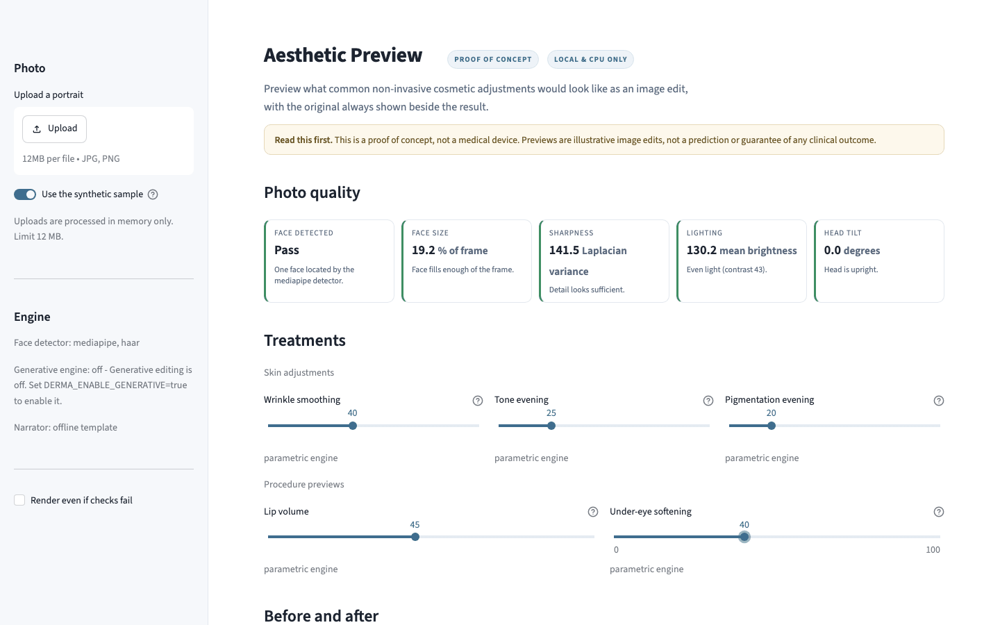
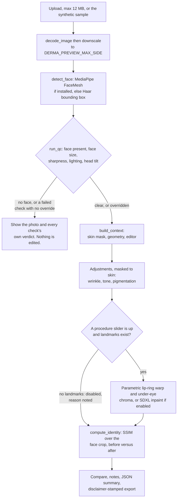
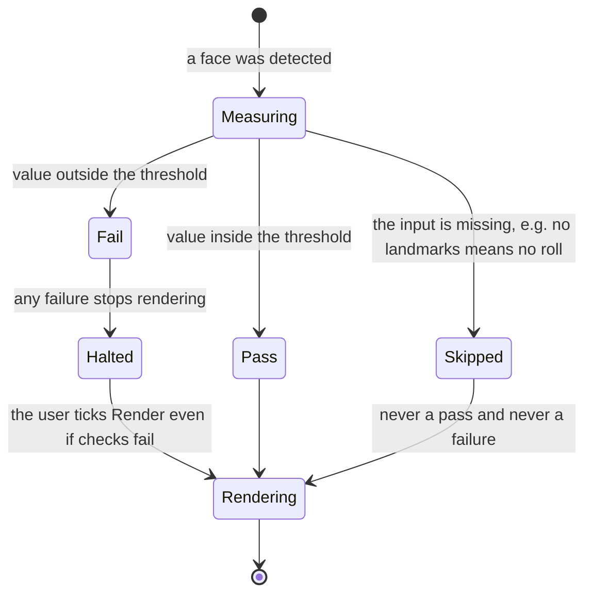

# Aesthetic Preview (Derma-Scan)

A local, CPU-only **proof of concept — not a medical device** — that previews what common
non-invasive cosmetic adjustments would look like *as an image edit* on a portrait. It
quality-checks the photo, applies filters and geometric warps inside a detected face
region, keeps the original on screen beside the result, and reports an SSIM signal for how
much image structure the edit changed.

> **Read this first.** The previews are illustrative image edits: they do not model biology
> and are not a simulation, a prediction or a guarantee of any clinical outcome, and
> nothing here is medical advice. No image leaves the machine — detection, editing and
> scoring all run locally on CPU.

## There is no real person's face in this repository

`assets/sample_face.jpg` is **procedurally generated** by `tools/make_sample_face.py`: a
few hundred seeded OpenCV primitives, `SEED = 20260923`, 768 × 768, no photographic
source. It reproduces byte for byte, so the claim is yours to check:

```bash
python tools/make_sample_face.py && md5sum assets/sample_face.jpg  # 66443d667af2e07d...
```

Every screenshot below uses it, the sidebar toggle that loads it says *"A procedurally
generated face … Not a real person"*, and no test touches a real photograph.

## What the screens look like

**Controls, and a report where every check answers for itself** — one the detector cannot
measure says so rather than quietly passing.



**Before and after** — the original is never off screen, each treatment is itemised with
its engine and cost, and a [wipe mode](docs/screenshots/03-wipe-compare.png) is the
alternative.


**Consultation notes** — what the edit did and what the identity number does not mean, by
Claude when `ANTHROPIC_API_KEY` is set, otherwise the offline template shown here.


**The Docker image, which ships no optional ML dependencies.** Haar detection, landmark
procedures disabled *with the reason shown*, head tilt "Not measured".


## From upload to preview

`src/pipeline.py` is the only module that knows this order and it imports no Streamlit
(`test_the_pipeline_never_imports_streamlit` pins that): `app.py` renders widgets and
copy, `src/cli.py` drives the identical path headlessly.



Treatments run in registry order and each is independently survivable: one whose region
cannot be located, whose dependency is missing, or which raises, is skipped with a note
the user sees (`test_a_treatment_that_raises_is_skipped_rather_than_crashing_the_app`).

## Pass, fail, or "not measured"

Quality control is per-check, and `skipped` is a first-class status: the Haar fallback has
no landmarks, so `FaceGeometry.roll_deg` is `None` and the tilt check reports `skipped`
rather than inventing a compliant `0.0°`
(`test_check_orientation_is_skipped_when_roll_cannot_be_measured`).



Most thresholds live in `QCThresholds` (`src/config.py`): Laplacian variance ≥ 100 at a fixed
512 px width so the score is size-stable, mean brightness 90–200, contrast ≥ 25, ≤ 15 %
clipped highlights or shadows, roll within ±20°. The minimum face coverage (4 % of frame) is
still a constant in `src/qc.py`. All are heuristics tuned on the synthetic sample, which is
why the ones in `QCThresholds` are configurable.

## The identity signal, and what it is not

SSIM on the greyscale face crop, original versus edit, reported against
`DERMA_IDENTITY_MIN_SSIM` (default `0.80`) with a plain verdict: *Barely changed* above
0.95, *Visible change, structure retained* above the threshold, *Large structural change*
below it. A crop too small for an SSIM window reports `0.0`, not a reassuring number.

It says how much image **structure** survived — nothing more. It is not a biometric match,
not identity verification, and a high score does not make an edit accurate, appropriate or
safe: wording that ships in the UI, the CLI, the JSON export and the narrator's system
prompt, and that `test_the_explanation_disclaims_biometric_identity` keeps there.

Two related guard-rails: no code path exports a lone "after" — `build_export` writes the
original beside the edit with a burnt-in banner
(`test_build_export_puts_the_original_next_to_the_edit`) — and the narrator's prompt forbids
clinical claims, dose or product recommendations and any comment on the person's appearance,
falling back to the template on refusal, truncation or any API error.

## Running it

```bash
docker compose up --build   # then open http://localhost:8200
docker compose down -v
```

It boots with the synthetic portrait already loaded, so there is nothing to upload first.
The image ships the **lightweight path**: `python:3.12-slim`, multi-stage, non-root
(`derma`, uid 10001), read-only root filesystem with tmpfs mounts, `no-new-privileges`,
healthchecked on `/_stcore/health`. The recorded build is **274 MB** and booted `healthy`
on `8200 -> 8501`, with `mediapipe`, `torch` and `diffusers` confirmed absent inside the
container and `available_detectors()` returning `['haar']` — so "works with no ML
dependencies" is the path actually built and booted, and screenshot 5 is that container.

Locally, plus the two optional extras the app detects at runtime and names in the sidebar:

```bash
python -m venv .venv && source .venv/bin/activate
pip install -r requirements.txt && streamlit run app.py

pip install -r requirements-landmarks.txt  # MediaPipe FaceMesh -> lip and under-eye previews
pip install -r requirements-ml.txt         # SDXL inpainting; also set DERMA_ENABLE_GENERATIVE=true
```

## The same pipeline, without a browser

`python -m src.cli` walks the identical code path, grows one flag per registered treatment,
and is the proof that the image layer has no UI dependency. A recorded run on the sample:

```console
$ python -m src.cli assets/sample_face.jpg --wrinkle 55 --tone 30
Image      : assets/sample_face.jpg (768x768)
  [PASS] Face detected: One face located by the haar detector.
  [PASS] Face size (30.9 % of frame): Face fills enough of the frame.
  [PASS] Sharpness (141.5 Laplacian variance): Detail looks sufficient.
  [PASS] Lighting (130.2 mean brightness): Even light (contrast 43).
  [SKIP] Head tilt: The haar detector does not provide landmarks, so head tilt could not be measured.
Detector   : haar
  applied  Wrinkle smoothing @ 55% (parametric, 11 ms)
  applied  Tone evening @ 30% (parametric, 101 ms)
  applied  Pigmentation evening @ 20% (parametric, 12 ms)
Identity   : SSIM 0.979 (threshold 0.80) - Barely changed
Total      : 141 ms

This is a proof of concept, not a medical device. Previews are illustrative image edits, not a prediction or guarantee of any clinical outcome.
```

`--out preview.png` writes the before/after pair, `--json` prints the structure the UI
downloads and the narrator reads, and `--force` renders past failed checks.

## Settings

`src/config.py` resolves these once at startup and is the only place the app reads its own
settings from `os.environ`; the one other reader is `src/narrative.py`, which checks whether
an Anthropic credential is present before attempting a call.

| Variable | Default | What it does |
| --- | --- | --- |
| `DERMA_PREVIEW_MAX_SIDE` | `1024` | Longest side an image is downscaled to before any processing. Cost is quadratic in it, so it is the main latency lever. |
| `DERMA_MAX_UPLOAD_MB` | `12` | Upload ceiling, enforced in `imaging.decode_image`. |
| `DERMA_IDENTITY_MIN_SSIM` | `0.80` | Threshold the identity signal is reported against. |
| `DERMA_FACE_DETECTOR` | `auto` | `auto`, `mediapipe` or `haar`; an unavailable preference falls back with a warning. |
| `DERMA_ENABLE_GENERATIVE` | `false` | Enables SDXL inpainting. Needs `requirements-ml.txt`; without it the UI says so and uses the parametric engines. |
| `DERMA_NARRATOR_ENABLED` | `true` | Allows Claude-written consultation notes. Off means the fixed template is always used. |
| `ANTHROPIC_API_KEY` | — | **Unset is a supported state**: the notes come from the deterministic template instead. |

Also read: `DERMA_EXPORT_MAX_SIDE` (`2048`), `DERMA_NARRATOR_MODEL` (`claude-opus-5`), `DERMA_LOG_LEVEL` (`INFO`), `DERMA_SDXL_MODEL_ID`, `DERMA_SDXL_MAX_SIDE` (`768`).

## Adding a treatment

One class. Its `TreatmentSpec` carries everything a UI needs to render a control — label,
help text, range, step, ordering, landmark and generative requirements — so no surface
grows a per-treatment branch:

```python
from src.treatments import ADJUSTMENT, Treatment, TreatmentSpec, register

@register
class Sepia(Treatment):
    spec = TreatmentSpec(key="sepia", label="Sepia", summary="Warms the skin region.",
                         group=ADJUSTMENT, order=5, default=0)

    def apply(self, image_rgb, context, intensity):
        ...  # must be a no-op at intensity 0
```

Import it in `src/treatments/__init__.py` and it becomes a slider, a `--sepia` flag, a row
in the JSON summary and an input to the consultation notes — nothing else changes, and
`test_a_third_party_treatment_needs_only_a_class` registers exactly this class at test time
to prove it. Detectors and the generative editor use the same shape — a `Protocol` with
`available()`, `unavailable_reason()` and the work method — so adding YuNet or RetinaFace is
one class plus `register_detector`.

## Tests and tooling

```bash
pip install -r requirements-dev.txt
pytest                                  # 201 tests across 11 files
ruff check . && ruff format --check .
```

No test downloads a model, needs a GPU, makes a network call or touches a real photograph:
`tests/conftest.py` supplies a synthetic FaceMesh landmark array and a recording generative
editor, `tests/test_narrative.py` installs a fake `anthropic` module, `tests/test_generative.py`
substitutes the SDXL pipeline, and the suite passes with none of MediaPipe, torch or `anthropic`
installed.

Streamlit re-runs the whole script on every slider nudge, so decode, detection and the skin
mask are cached on a SHA-256 fingerprint of the pixels, and `imaging.masked_filter` crops to
the mask's bounding box before the expensive bilateral/CLAHE pass —
`test_masked_filter_matches_a_full_frame_pass_for_a_shift_invariant_filter` proves that crop
changes nothing.

## What it does not do

- **Not a medical device, and not a biological simulation.** Filters and warps cannot
  predict how tissue responds to a procedure; nothing here should inform a real decision.
- **The identity number is change magnitude, not identity verification.** It will not
  catch an edit that is structurally small but perceptually wrong.
- **Lip and under-eye previews need MediaPipe FaceMesh.** Without it the Haar cascade
  gives a bounding box only, those treatments are disabled and the skin mask degrades to an
  inset ellipse. The app uses the legacy `mediapipe.solutions.face_mesh` API, which builds
  from 0.10.30 onward drop on some platforms — hence the cap in
  `requirements-landmarks.txt` and an `available()` that probes the API, not the import.
- **Generative editing is slow and untested end to end.** SDXL inpainting on CPU takes
  minutes per pass; dispatch, ROI cropping and compositing are covered with a fake pipeline,
  but real model output is not — no test may download weights.
- **One face per image**, frontal and reasonably lit. No multi-face handling, no pose
  correction, no profiles.
- **No accounts and no persistence.** Images are processed in memory and discarded; nothing
  is written to disk except what you choose to download.

## License

MIT — see [LICENSE](LICENSE).
